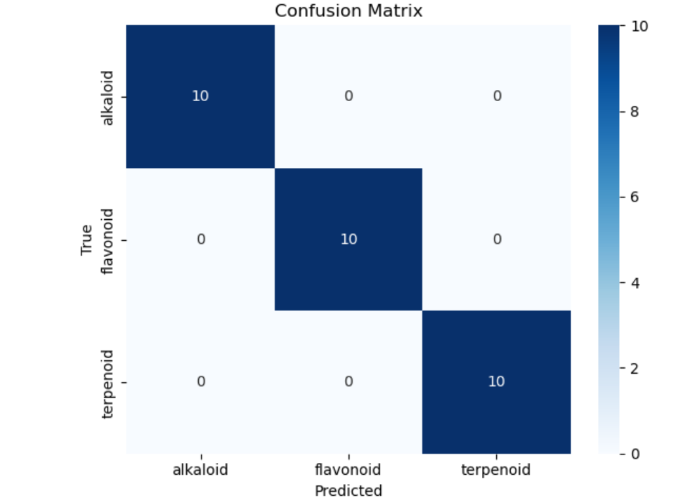
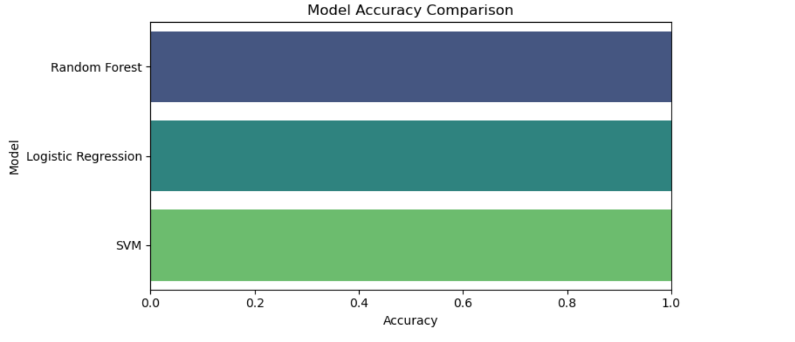
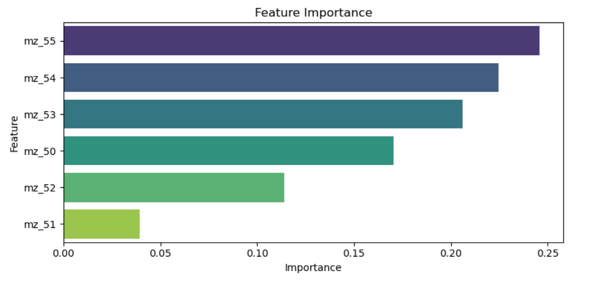

# Plant MS Classifier

<p align="center">
  
  
  
</p>

Machine learning project to classify plant-derived mass spectra into natural product classes using Python and scikit-learn.

## Overview

This project uses supervised machine learning to classify plant mass spectrometry data into natural product classes such as alkaloids, flavonoids, and terpenoids. The goal is to demonstrate a simple classification workflow for biological or chemical datasets using Python, feature selection, model training, and visualization.

## Features

- Classifies plant-derived mass spectra into natural product classes
- Uses Python and scikit-learn for model development
- Includes model evaluation with a confusion matrix
- Compares model accuracy visually
- Shows feature importance for interpretation

## Project Structure

```text
plant-ms-classifier/
├── images/
│   ├── accuracy_bar_chart.png
│   ├── confusion_matrix.png
│   └── feature_importance.png
├── plant_ms_classifier.ipynb
└── README.md
```

## Tools and Libraries

- Python
- Jupyter Notebook
- pandas
- numpy
- matplotlib
- seaborn
- scikit-learn

## Workflow

1. Load and preprocess the mass spectrometry dataset.
2. Train a classification model using scikit-learn.
3. Evaluate performance using accuracy metrics and a confusion matrix.
4. Visualize results with charts and feature importance plots.

## Results

### Classification Report

The model achieved high classification performance across the selected plant compound classes, with strong precision, recall, and F1-scores in the sample output.

### Visualizations

#### Confusion Matrix

<p align="center">
  
</p>

#### Accuracy Comparison

<p align="center">
  
</p>

#### Feature Importance

<p align="center">
  
</p>

## How to Run

1. Clone this repository:
   ```bash
   git clone https://github.com/avaerichards/plant-ms-classifier.git
   ```

2. Open the project folder:
   ```bash
   cd plant-ms-classifier
   ```

3. Launch Jupyter Notebook:
   ```bash
   jupyter notebook
   ```

4. Open `plant_ms_classifier.ipynb` and run the cells.

## Applications

This type of workflow can be useful in:

- Natural products research
- Metabolomics
- Plant biochemistry
- Introductory machine learning for scientific data

## Future Improvements

- Add more plant compound classes
- Test additional machine learning models
- Include cross-validation results
- Add a cleaned sample dataset to the repository
- Convert the notebook into a Python script or small web app

## Author

**Ava Richards**  
Biomedical science / biochemistry student interested in machine learning, chemistry, and data analysis.
